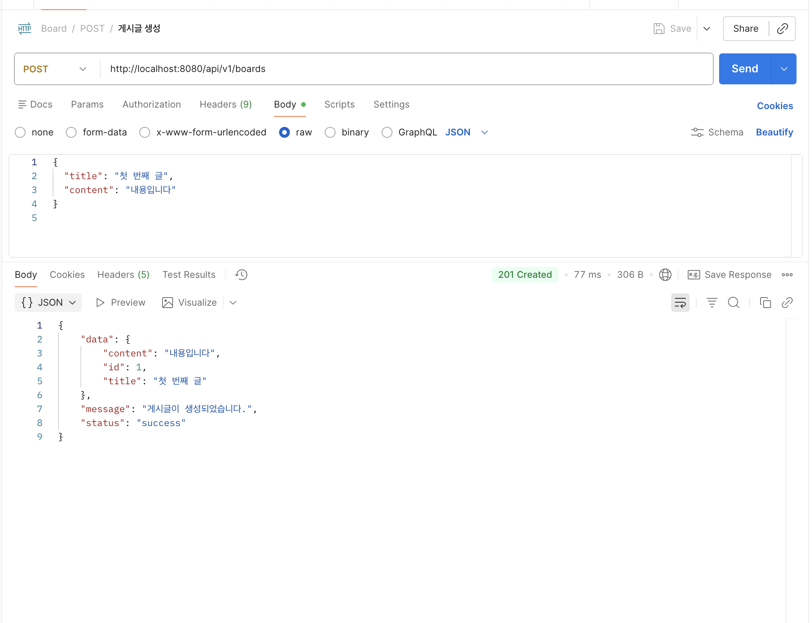
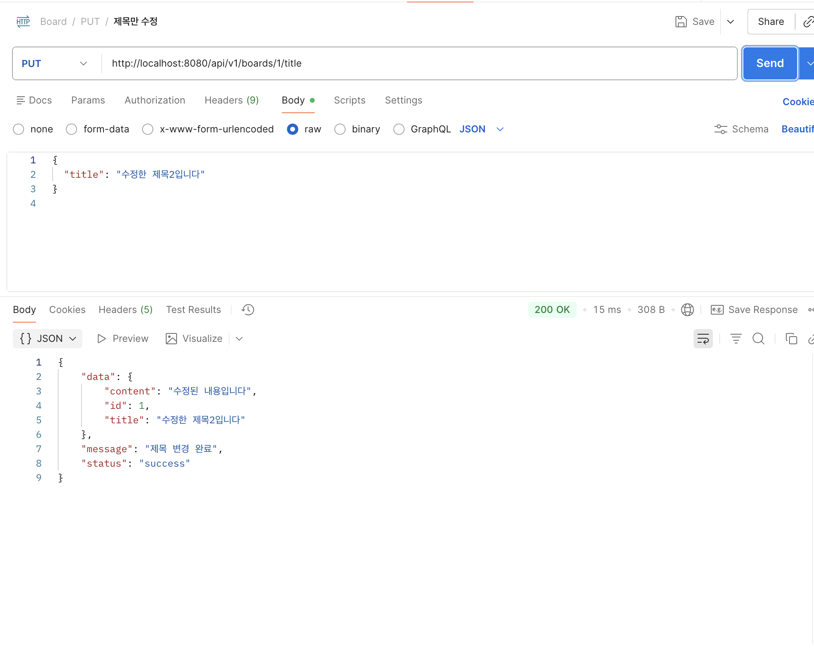

# 📘 Spring Boot 게시판 CRUD REST API

간단한 메모리 기반 저장소를 사용해 CRUD 기능을 학습하기 위한 Spring Boot 실습 프로젝트입니다.  
요구 조건인 `POST / GET / PUT / DELETE` 각각 2개의 REST API(총 8개), 커스텀 미들웨어, 표준화된 응답 포맷, 다양한 HTTP Status Code(2xx/4xx/5xx)를 모두 충족합니다.

## 🧰 기술 스택
- Java 17+
- Spring Boot 3.x
- Spring Web
- Lombok (선택)
- Postman (API 테스트)
- IntelliJ IDEA

## 📂 프로젝트 구조
```
src/
└─ main/
   ├─ java/com/example/board
   │  ├─ BoardApplication.java
   │  ├─ controller/BoardController.java
   │  ├─ dto/
   │  │  ├─ BoardDto.java
   │  │  ├─ BoardCreateRequest.java
   │  │  └─ BoardUpdateRequest.java
   │  └─ middleware/
   │     └─ LoggingFilter.java
   └─ resources/
      └─ application.properties
```

## 🧩 Middleware
`middleware/LoggingFilter.java` 는 모든 요청마다 URL, HTTP Method 등을 로깅하여 간단한 관찰 가능성을 제공합니다. `@Component` 로 등록된 Servlet `Filter` 이므로 별도 설정 없이 자동 실행됩니다.

## 📑 표준 응답 포맷
모든 컨트롤러 응답은 동일한 Map 구조를 사용해 일관된 응답 형태를 유지합니다.

```json
{
  "status": "success | error",
  "data": { ... } | null,
  "message": "응답 메시지"
}
```

## 🚀 구현된 API (총 8개)

### 🔵 POST
| # | Method | Endpoint | 설명 | Status |
|---|--------|----------|------|--------|
| 1 | POST | `/api/v1/boards` | 게시글 생성 | `201 Created` |
| 2 | POST | `/api/v1/boards/with-header` | `X-USER` 헤더를 포함한 생성 | `201 Created` |

### 🟢 GET
| # | Method | Endpoint | 설명 | Status |
|---|--------|----------|------|--------|
| 3 | GET | `/api/v1/boards` | 전체 게시글 조회 | `200 OK` |
| 4 | GET | `/api/v1/boards/{id}` | 단일 게시글 조회 | `200 OK`, `404 Not Found` |

### 🟠 PUT
| # | Method | Endpoint | 설명 | Status |
|---|--------|----------|------|--------|
| 5 | PUT | `/api/v1/boards/{id}` | 제목/내용 전체 수정 | `200 OK`, `404 Not Found` |
| 6 | PUT | `/api/v1/boards/{id}/title` | 제목만 수정 (body의 `title` 필수) | `200 OK`, `400 Bad Request`, `404 Not Found` |

### 🔴 DELETE
| # | Method | Endpoint | 설명 | Status |
|---|--------|----------|------|--------|
| 7 | DELETE | `/api/v1/boards/{id}` | 단일 게시글 삭제 | `204 No Content`, `404 Not Found` |
| 8 | DELETE | `/api/v1/boards` | 전체 삭제 (의도적 서버 오류 테스트) | `500 Internal Server Error` |

> ⚠️ `DELETE /api/v1/boards` 전체 삭제 엔드포인트는 고의적으로 서버 오류(`500 Internal Server Error`)를 발생시켜 5xx 시나리오를 검증하도록 설계되었습니다. 아래 첨부한 `delete-all-error.png`에서도 확인할 수 있듯이, 오류 응답이 곧 정상 동작입니다.

## 🧪 HTTP Status Code 요약
| 분류 | 예시 |
|------|------|
| 2xx | `201 Created`, `200 OK`, `204 No Content` |
| 4xx | `400 Bad Request`, `404 Not Found` |
| 5xx | `500 Internal Server Error` (전체 삭제 엔드포인트에서 고의 발생) |

## 📸 Postman 테스트 캡처
프로젝트 루트의 `image/` 디렉터리에 모든 API 호출 캡처를 추가했고, 아래에 바로 확인할 수 있도록 삽입했습니다.

1. `POST /api/v1/boards` – 게시글 생성  
   
2. `POST /api/v1/boards/with-header` – 헤더 포함 생성  
   
3. `GET /api/v1/boards` – 전체 조회  
   
4. `GET /api/v1/boards/{id}` – 단일 조회  
   
5. `PUT /api/v1/boards/{id}` – 제목/내용 전체 수정  
   
6. `PUT /api/v1/boards/{id}/title` – 제목만 수정  
   
7. `DELETE /api/v1/boards/{id}` – 단일 삭제  
   
8. `DELETE /api/v1/boards` – 전체 삭제(고의 500 오류)  
   

8번 캡처에서는 요구 조건 충족을 위해 고의로 서버 오류를 발생시킨 모습이 나타나며, 이는 정상 동작입니다.

## ▶️ 실행 방법
```bash
# IntelliJ IDEA 또는 다른 IDE에서 BoardApplication 실행

# 터미널에서 실행
./gradlew bootRun

# 패키징
./gradlew build
java -jar build/libs/board-0.0.1-SNAPSHOT.jar
```

## ✔ 체크리스트
| 요구사항 | 충족 여부 |
|----------|-----------|
| POST / GET / PUT / DELETE 각각 2개씩 구현 | ✅ |
| 총 8개 API 구현 | ✅ |
| Middleware 구현 | ✅ |
| 다양한 HTTP Status Code 사용 (2xx/4xx/5xx) | ✅ |
| 표준 응답 포맷 사용 | ✅ |
| GitHub 코드 제출 | ✅ |
| Postman 캡처 첨부 | ✅ |
